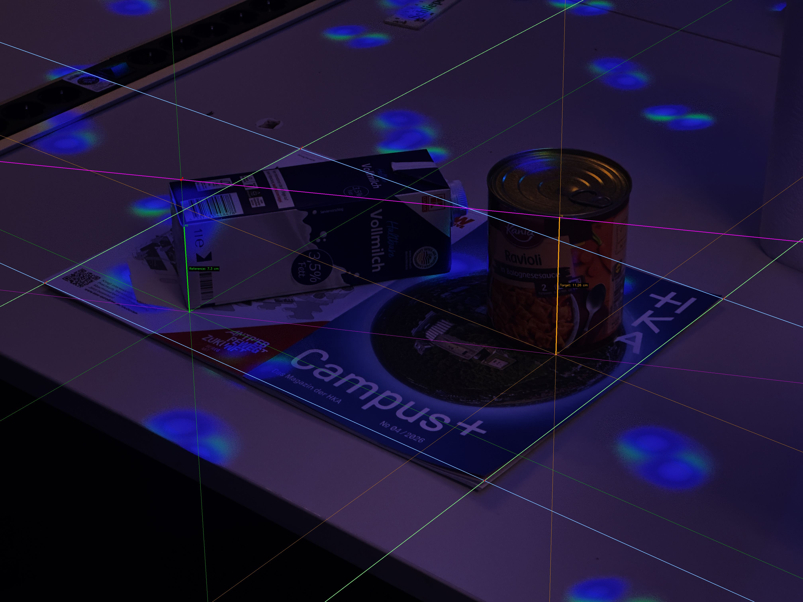
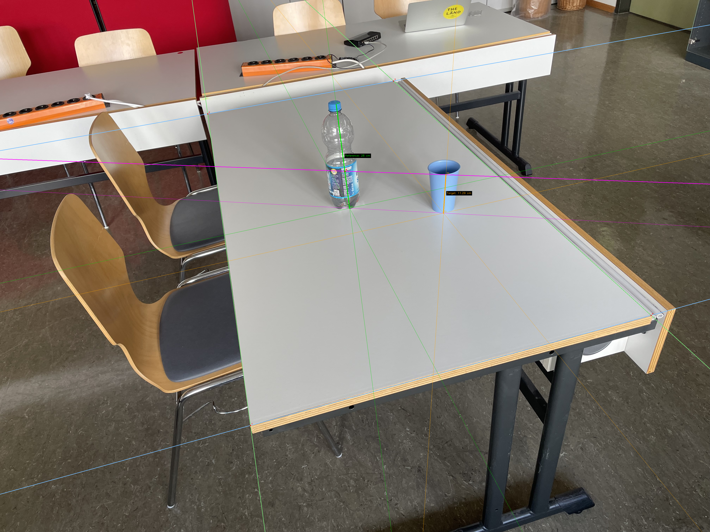

# A2: Single-View Height Measurement


Beispiel mit eingezeichneter Geometrie:


## Starten

Aus dem Projektordner:

```bash
python3 a2/src/main.py
```


## Voraussetzungen

- Python 3
- `opencv-python`
- `numpy`


## Bedienung

Klickreihenfolge:

1. `corner 1`
2. `corner 2`
3. `corner 3`
4. `corner 4`
5. `reference base`
6. `reference top`
7. nach Punkt 6 die bekannte Referenzhoehe eintippen
8. mit `Enter` bestaetigen
9. dann Zielbasis und Zielspitze klicken
10. `target base`
11. `target top`

Tasten:
- `n` nächstes Bild
- `p` vorheriges Bild
- `z` zwischen `100%` und `Auto-Scale` wechseln
- `u` letzten Punkt rueckgaengig machen
- `r` Punkte des aktuellen Bildes loeschen
- `e` Referenzhoehe erneut eingeben
- `s` Overlay-Bild speichern
- `Esc` oder `q` beenden

Der `Auto-Scale`-Modus vergrößert den sichtbaren Weltbereich so, dass wichtige geometrische Konstruktionen besser sichtbar sind:


## Ordneraufbau

```text
a2/
├── img/
│   ├── slide61_ws02.png
│   ├── table_bottle01.jpeg
│   ├── table_bottle02.jpeg
│   ├── table_bottle03.jpeg
│   └── *_vanishing_line.png
└── src/
    ├── main.py
    ├── app.py
    ├── config.py
    ├── drawing.py
    ├── geometry.py
    └── text_rendering.py
```

Kurze Rollen der Dateien:

- `main.py`: Einstiegspunkt
- `app.py`: GUI-Loop, Eingaben, Bildwechsel, Tastatur und Maus
- `config.py`: Konstanten, Farben, Bildpfade
- `drawing.py`: Rendering der Overlays und GUI
- `geometry.py`: Fluchtpunkt-, Horizont- und Höhengeometrie
- `text_rendering.py`: kleine Text-Helfer für OpenCV

## Bilder hinzufügen

Standardmässig werden alle Bilder geladen, die zu diesem Muster passen:

```text
a2/img/table_bottle*.jpeg
```

Beispiele:

- `table_bottle04.jpeg`
- `table_bottle_test.jpeg`

## Ausgabe

Mit `s` wird ein Overlay neben dem Originalbild gespeichert, zum Beispiel:

```text
table_bottle01_vanishing_line.png
```

Dieses Bild enthält die aktuelle geometrische Konstruktion und die gemessenen Objekte.

## Aufgabe berechntet


Berechnet wurden 11.29cm für die Höhe des Bechers 
