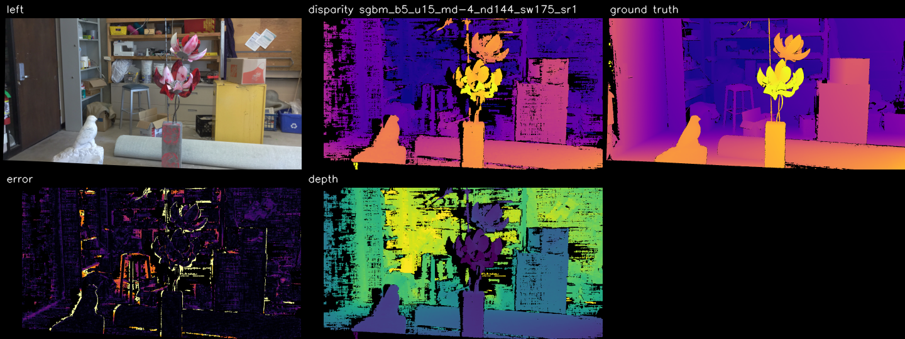

# A3: Simple Stereo

This assignment computes a disparity map from a stereo image pair, evaluates it
against the ground truth, derives a depth map, and exports a colored point
cloud.

Data used in this assignment:

- `a3/images/artroom_im0.png`
- `a3/images/artroom_im1.png`
- `a3/images/disp0.pfm`
- `a3/data/artroom_calib.npz`

## Project Structure

The current setup consists of two parts:

- [a3/src/simple_stereo.py](/Users/unknownacc/Documents/Studium/Master/SS/Computer%20Vision/git/Computer-Vision/a3/src/simple_stereo.py)  
  Core logic for loading data, stereo matching, evaluation, depth computation,
  and export

- [a3/src/web_ui.py](/Users/unknownacc/Documents/Studium/Master/SS/Computer%20Vision/git/Computer-Vision/a3/src/web_ui.py)  
  Small browser UI for parameter tuning and saved tests

The browser assets are stored separately in:

- [a3/src/web/index.html](/Users/unknownacc/Documents/Studium/Master/SS/Computer%20Vision/git/Computer-Vision/a3/src/web/index.html)
- [a3/src/web/static/styles.css](/Users/unknownacc/Documents/Studium/Master/SS/Computer%20Vision/git/Computer-Vision/a3/src/web/static/styles.css)
- [a3/src/web/static/app.js](/Users/unknownacc/Documents/Studium/Master/SS/Computer%20Vision/git/Computer-Vision/a3/src/web/static/app.js)

## Features

- Stereo matching with `StereoSGBM` or `StereoBM`
- Disparity map computation
- Ground-truth evaluation with `MAE` and `Bad3`
- Depth map computation
- Colored point cloud export as `.ply`
- Browser UI for testing and comparing different settings
- Saving tests including parameters and metrics

## Running the Core Script

From the repository root:

```bash
.venv/bin/python a3/src/simple_stereo.py
```

Run with a different algorithm:

```bash
.venv/bin/python a3/src/simple_stereo.py --algorithm bm --block-size 15
```

Show command help:

```bash
.venv/bin/python a3/src/simple_stereo.py -h
```

## Web UI

Start the browser UI with:

```bash
.venv/bin/python a3/src/web_ui.py
```

Then open the printed URL in your browser, typically:

```text
http://127.0.0.1:8765
```

If port `8765` is already in use, the application automatically selects the
next free port and prints the final URL in the terminal.

### What the UI Can Do

- Select the algorithm: `StereoSGBM` or `StereoBM`
- Adjust the following parameters:
  - `block_size`
  - `uniqueness_ratio`
  - `min_disparity`
  - `num_disparities`
  - `speckle_window_size`
  - `speckle_range`
- `Compute`: run the current configuration
- `Export`: save images and the point cloud
- `Save Test`: store the current parameters and metrics
- Reload a saved test via `Load Test ID`
- Switch between views:
  - `comparison`
  - `left`
  - `disparity`
  - `ground_truth`
  - `error`
  - `depth`
- Sort saved tests by `MAE` or `Bad3`

## Saved Tests

Saved tests are stored in:

- [a3/output/tests.json](/Users/unknownacc/Documents/Studium/Master/SS/Computer%20Vision/git/Computer-Vision/a3/output/tests.json)

Each saved test contains:

- `id`
- `timestamp`
- `params`
- `metrics`

Only settings and metrics are stored there, not images.

## Outputs

Exports are written to `a3/output/`.

Depending on the current configuration, files such as the following are
generated:

- `comparison_<label>.png`
- `disparity_<label>.png`
- `depth_<label>.png`
- `error_<label>.png`
- `point_cloud_<label>.ply`
- `ground_truth_disparity.png`

The `label` encodes the selected parameters, for example:

```text
sgbm_b5_u15_md-4_nd144_sw175_sr1
```

Meaning:

- `sgbm` = algorithm
- `b5` = `block_size = 5`
- `u15` = `uniqueness_ratio = 15`
- `md-4` = `min_disparity = -4`
- `nd144` = `num_disparities = 144`
- `sw175` = `speckle_window_size = 175`
- `sr1` = `speckle_range = 1`

## Metrics

The evaluation uses:

- `MAE`  
  Mean Absolute Error between the computed disparity and the ground truth

- `Bad3`  
  Percentage of pixels with an error larger than `3` pixels

## Current Results

The following results come from the saved tests in
[a3/output/tests.json](/Users/unknownacc/Documents/Studium/Master/SS/Computer%20Vision/git/Computer-Vision/a3/output/tests.json).

### `StereoSGBM` test

- Test ID: `1`
- Parameters:
  - `block_size = 5`
  - `uniqueness_ratio = 15`
  - `min_disparity = -4`
  - `num_disparities = 144`
  - `speckle_window_size = 175`
  - `speckle_range = 1`
- Metrics:
  - `MAE = 2.06 px`
  - `Bad3 = 8.13%`

### `StereoBM` test

- Test ID: `4`
- Parameters:
  - `block_size = 15`
  - `uniqueness_ratio = 10`
  - `min_disparity = 0`
  - `num_disparities = 176`
  - `speckle_window_size = 100`
  - `speckle_range = 2`
- Metrics:
  - `MAE = 2.23 px`
  - `Bad3 = 8.02%`

### Example comparison images

Best `StereoSGBM` comparison:



Best `StereoBM` comparison:


## Technical Pipeline

1. Load the stereo images and calibration data
2. Create a matcher (`StereoBM` or `StereoSGBM`)
3. Compute the disparity map
4. Mark invalid disparity values as `NaN`
5. Evaluate the result against `disp0.pfm`
6. Compute depth using:

```text
Z = f * B / (disparity + doffs)
```

7. Derive 3D points from the disparity map
8. Export a colored point cloud as `.ply`

## Notes

- `num_disparities` must be divisible by `16`; the code adjusts it
  automatically.
- For `StereoBM`, `block_size` is corrected to a valid odd value `>= 5`.
- Invalid disparity values are excluded from evaluation, depth computation, and
  point-cloud export.
