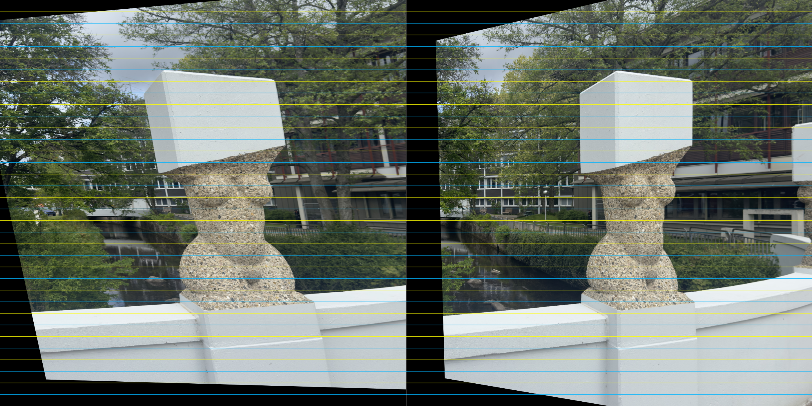

# A4: Own Stereo Rectification

This assignment implements an uncalibrated stereo pipeline for a self-captured
left/right image pair.

## Run

Put your own images here:

```text
a4/images/my_pair_left.png
a4/images/my_pair_right.png
```

For the two lab images from the table scene, save the first image as
`my_pair_left.png` and the second image as `my_pair_right.png`. The script
resizes large phone images internally by default, so the original files can stay
at full resolution.

Then run from the project root:

```bash
.venv/bin/python a4/src/own_stereo_rectification.py
```

You can also pass image paths explicitly:

```bash
.venv/bin/python a4/src/own_stereo_rectification.py \
  --left a3/images/artroom_im0.png \
  --right a3/images/artroom_im1.png
```

Useful options for difficult own image pairs:

```bash
.venv/bin/python a4/src/own_stereo_rectification.py \
  --detector sift \
  --max-image-size 1400 \
  --ransac-threshold 1.5
```

If a reliable calibration `.npz` from A1 or A3 is available, the script can use
it for calibrated rectification and metric depth:

```bash
.venv/bin/python a4/src/own_stereo_rectification.py \
  --calibration a1/calibration.npz \
  --baseline 0.08 \
  --baseline-unit m
```

Without `--baseline`, the script still saves a relative depth map by inverting
the disparity.

For the iPhone images used here, I did not use the A1 calibration in the final
run because the phone JPEGs are already internally processed and the estimated
calibration was not stable enough. Instead, I used uncalibrated rectification
and an approximate focal length from the image metadata.

## Pipeline

1. Load the stereo pair and convert it to grayscale
2. Detect local features, preferably SIFT when available, and match them with
   Lowe's ratio test
3. Estimate the fundamental matrix with RANSAC
4. Compute uncalibrated rectification homographies with
   `cv2.stereoRectifyUncalibrated`
5. Warp both images with `cv2.warpPerspective`
6. Compute disparity on the rectified images with `StereoSGBM`
7. Compute relative or metric depth from disparity

## Outputs

Results are written to `a4/output/`:

- `01_matches_inliers.png`: inlier feature matches after RANSAC
- `02_rectified_left.png`: rectified left image
- `03_rectified_right.png`: rectified right image
- `04_rectification_check.png`: rectified pair with horizontal guide lines
- `05_disparity.png`: normalized disparity map
- `06_depth.png`: normalized relative or metric depth map
- `07_disparity.npy`: raw disparity values in pixels
- `08_depth.npy`: raw relative or metric depth values
- `09_depth_stats.txt`: min, max, mean, median, and percentile summary

The terminal report prints the number of matches and RANSAC inliers, plus the
mean and median vertical correspondence error before and after rectification.

Example rectification check:



## Final Run

For the final run I used the following command:

```bash
.venv/bin/python a4/src/own_stereo_rectification.py \
  --left a4/images/IMG_6405.jpg \
  --right a4/images/IMG_6406.jpg \
  --output-dir a4/output/test_nd256_b7_u10 \
  --max-image-size 1400 \
  --detector auto \
  --focal-px 5600 \
  --baseline 0.15 \
  --baseline-unit m \
  --num-disparities 256 \
  --block-size 7 \
  --uniqueness-ratio 10
```

The original images are `6048 x 6048` pixels. I resize them to `1400 x 1400`
for matching, because full resolution is slow and did not improve the disparity
map. Since the focal length is given in pixels, it has to be scaled in the same
way:

```text
scale = 1400 / 6048 = 0.231
focal_px = 5600 * 0.231 = 1296.30 px
```

The value `--focal-px 5600` is an estimate for the iPhone 15 Pro main camera.
The image metadata gives the camera as `24 mm`. Using the full-frame diagonal
of about `43.3 mm` and the full 48 MP iPhone image size of `8064 x 6048`, the
image diagonal is:

```text
sqrt(8064^2 + 6048^2) = 10080 px
```

From that, the focal length in pixels is estimated as:

```text
focal_px = image_diagonal_px * focal_mm_equiv / full_frame_diagonal_mm
focal_px = 10080 * 24 / 43.3 = 5587 px
```

I rounded this to `5600 px`. The input images are square `6048 x 6048` crops,
but the focal length is still based on the camera before the resize step. This
is not a lab-grade calibration; it is a practical estimate, especially because
iPhone JPEGs are already processed by the phone.

The camera shift was not measured exactly. I entered it as an estimated
baseline of `0.15 m`. Depth is then computed with:

```text
depth = focal_px * baseline / disparity
```

The resulting depth statistics are:

```text
depth mode: metric
unit: m
focal length px: 1296.296296
baseline: 0.150000 m
valid pixels: 280378 / 1960000
min: 0.762527 m
p05: 0.839027 m
median: 8.318479 m
mean: 24.421709 m
p95: 111.111107 m
max: 345.679016 m
```

## Result Discussion

The rectification is the strongest part of the result. Before rectification,
the vertical error was about `38.42 px` mean / `39.19 px` median. After
rectification it drops to about `0.19 px` mean / `0.13 px` median. The
corresponding points are therefore nearly on the same image rows.

The stone figure works best in the disparity and depth images. It has a rough
surface, visible edges, and enough texture. These are good conditions for
`StereoSGBM`, because patches from the left image can be matched more clearly
to patches in the right image. That is why the figure appears as one of the
more coherent areas in the result. The flat white parts of the stone sculpture
work worse, though. They are almost textureless and have very similar pixel
values over a larger area. In those regions the matcher cannot identify a
unique corresponding patch, so the disparity becomes noisy or invalid.

The background is harder. Trees, windows, railings, and reflections create many
similar-looking patches. Some parts are also very thin or are visible in one
image but partly hidden in the other. In those areas the matcher either finds a
wrong correspondence or rejects the pixel. This produces the black invalid
regions and the noisy isolated depth points in the background.

The metric values should be read as an approximation. The images come from an
iPhone, and the phone already processes and corrects the JPEGs internally. The
focal length and baseline are also estimated values. For that reason, I use the
depth map mainly to show the depth ordering in the scene, not as an exact 3D
measurement.
