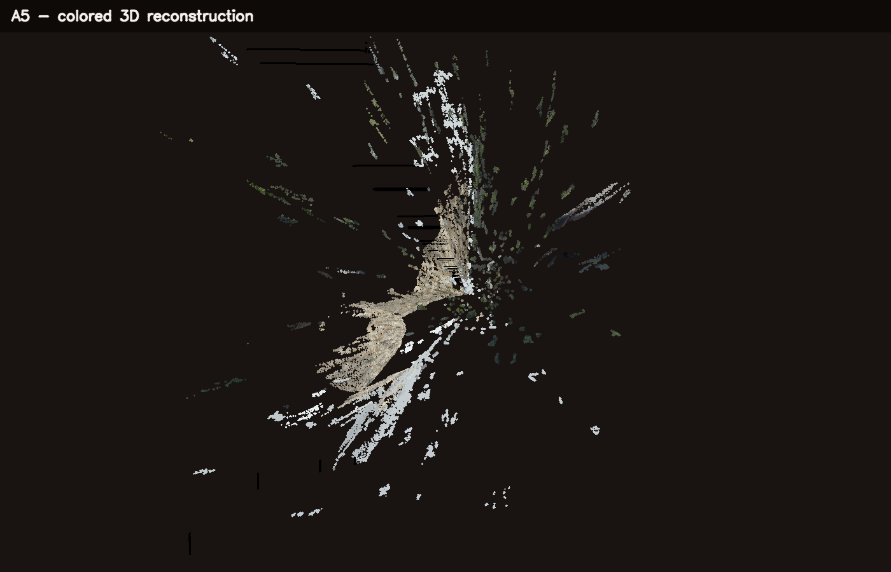

# A5: 3D Reconstruction

This assignment documents a 3D reconstruction workflow, exports a colored point
cloud, and includes a small dependency-free 3D renderer for the final result.

## Capture Setup

The scene is the outdoor stone sculpture already captured for A4. The images
were taken with an iPhone 15 Pro as `6048 x 6048` JPEGs under daylight. The
camera was moved approximately `0.15 m` horizontally between the two images.
The rough stone surface is useful because it contains many local features. The
white stone, windows, railings, vegetation, and reflections are more difficult
because they contain repeated patterns, weak texture, and occlusions.

The original images are not duplicated in `a5`, in accordance with the
submission rule. The current reproducible fallback reads the existing A4
results from:

```text
a4/output/test_nd256_b7_u10/02_rectified_left.png
a4/output/test_nd256_b7_u10/08_depth.npy
```

For a proper new multi-view capture, images should be placed in
`a5/data/scene/images/` and should have approximately 70-80% overlap. Exposure,
focus, and focal length should remain fixed while moving around the object.

## Model Choice: VGGT

The selected geometric foundation model is
[VGGT](https://github.com/facebookresearch/vggt) (CVPR 2025). It was chosen
because it predicts camera parameters, depth maps, point maps, and tracks in a
single feed-forward model. Its official repository also provides a Viser
viewer and `demo_colmap.py`, which exports predictions in COLMAP format. This
makes it a better fit for the complete assignment pipeline than a model that
only estimates monocular depth.

The official checkpoint is a 1B-parameter model and the reference quick start
selects CUDA when available. The available machine is a 16 GB Apple M1 Pro,
and neither CUDA nor COLMAP is installed. Therefore, the VGGT inference and
COLMAP stages were not claimed as completed locally. The repository includes
reproducible runners for both stages, while the submitted point cloud is an
explicitly labeled classical stereo fallback based on the real captured pair.

## Project Structure

```text
a5/
  README.md
  Workshop-05-3DReconstruction.md
  src/
    export_point_cloud.py  # depth map to colored PLY
    visualize.py           # PLY renderer and screenshot export
    run_colmap.py          # standard COLMAP sparse reconstruction
    run_vggt.py            # wrapper for VGGT's official demo_colmap.py
  output/
    final_reconstruction.ply
    final_reconstruction.json
    visualization.png
```

## Reproduce the Submitted Result

Run from the repository root:

```bash
.venv/bin/python a5/src/export_point_cloud.py
.venv/bin/python a5/src/visualize.py
```

The PLY is ASCII and can also be opened directly in MeshLab. To inspect it in
the included interactive viewer:

```bash
.venv/bin/python a5/src/visualize.py --interactive
```

Controls are `W/A/S/D` for rotation, `+/-` for zoom, and `Q` or `Esc` to quit.
The non-interactive mode works without a display and always writes the
screenshot.

## COLMAP Workflow

After adding at least three overlapping images, run:

```bash
.venv/bin/python a5/src/run_colmap.py \
  --images a5/data/scene/images \
  --workspace a5/colmap
```

The script performs feature extraction, exhaustive matching, mapping, and
conversion to both text and PLY formats. It stops with a clear error if COLMAP
is missing or the image sequence is too small.

## VGGT Workflow

Install VGGT in a separate environment according to its official README. Then
run its official COLMAP export through the included wrapper:

```bash
python a5/src/run_vggt.py \
  --vggt-repo /path/to/vggt \
  --scene-dir a5/data/scene \
  --use-ba
```

`a5/data/scene/images/` must contain only the input images. VGGT writes camera
parameters and 3D points to `a5/data/scene/sparse/` in COLMAP format.

## Current Result

The fallback uses the rectified left image for color and the metric A4 depth
map for geometry. Intrinsics use the previously documented scaled focal length
of `1296.30 px`, with the principal point at the image center. Points outside
`0.8-20.0 m` are rejected because the stereo matcher produces extreme depths
for disparities close to zero.

- Valid points before sampling: `197,352`
- Exported colored points: `150,000`
- PLY size: approximately `5.1 MB`
- Depth unit: meters, based on the estimated `0.15 m` baseline



## Failure Cases and Discussion

The stone sculpture is the most coherent part of the reconstruction. Its rough
surface yields distinctive correspondences, and the side view reveals a clear
depth variation rather than a flat image plane.

The point cloud is incomplete and contains streaks. Textureless white areas
produce ambiguous matches, while vegetation and railings create repeated thin
structures. Occlusions and reflections violate the assumptions of dense stereo.
Depth also becomes unstable when disparity approaches zero, so the far
background must be clipped.

The largest limitation is the capture itself: two images are enough for a
stereo fallback but not for a robust full-object COLMAP reconstruction. A final
VGGT experiment should use 20-40 sharp images around the object. That would
reduce holes, provide camera poses around the complete sculpture, and make a
comparison between COLMAP, VGGT, and classical stereo meaningful.

## References

- [VGGT official repository](https://github.com/facebookresearch/vggt)
- [VGGT paper](https://arxiv.org/abs/2503.11651)
- [COLMAP documentation](https://colmap.github.io/)
