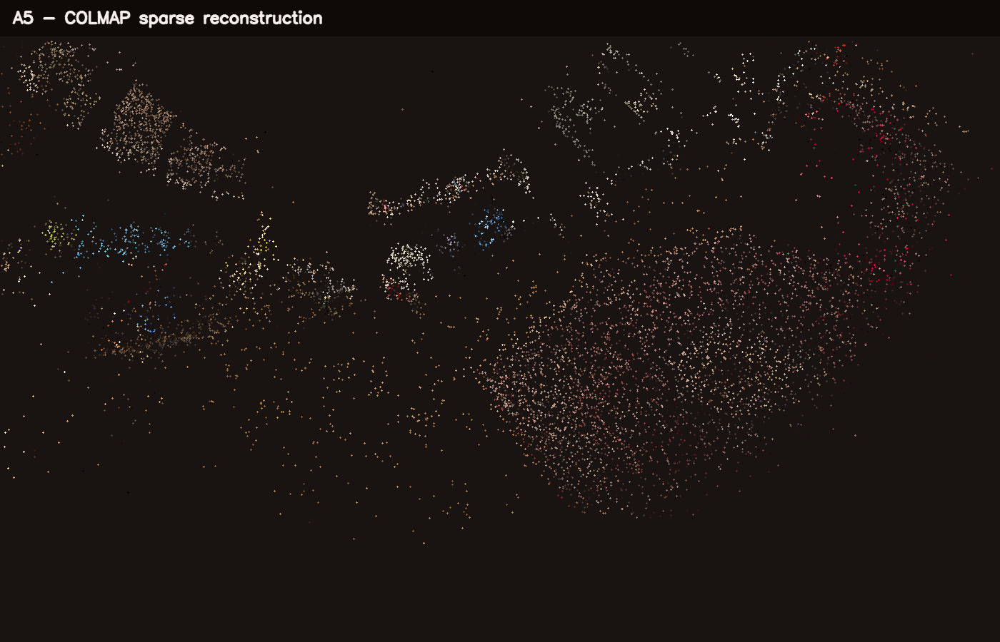
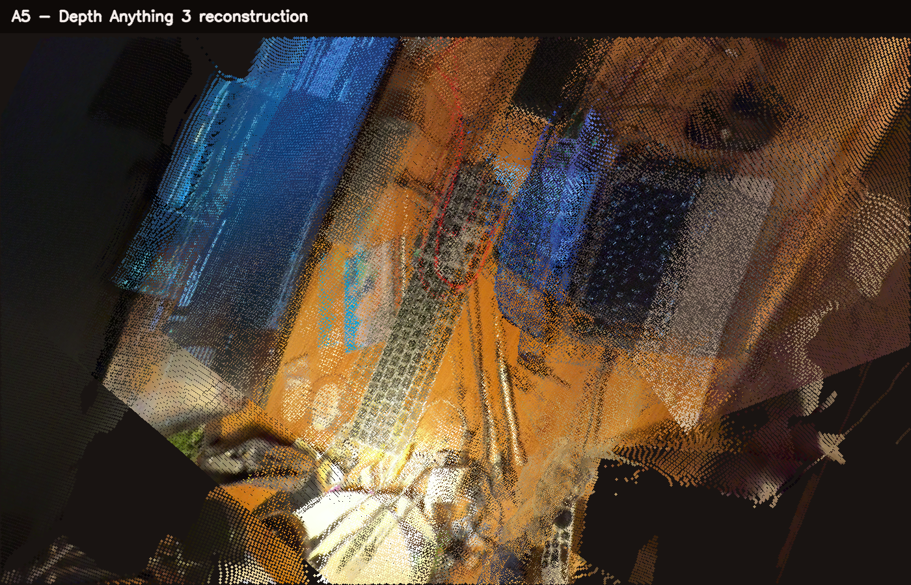

# A5: 3D Reconstruction

This assignment reconstructs a scene from an iPhone video with two independent
methods:

- COLMAP estimates camera poses and creates a sparse feature point cloud.
- Depth Anything 3 (DA3) predicts multi-view depth and cameras and fuses the
  depth maps into a dense colored point cloud.

The local web interface extracts video frames, runs both methods, renders the
results, displays live logs and offers all generated files for download.

## Input

Videos belong in `a5/video/`. The current inputs include `IMG_6753.MOV`,
`IMG_6757.MOV` and `IMG_6758.MOV`. Frames are extracted to
`a5/data/scene/images/`; generated frames are not committed and can always be
recreated from the video.

COLMAP uses all extracted frames. DA3 samples a configurable number of views
from the same set and internally resizes them to its selected processing
resolution.

## Native macOS Setup

Install the native tools:

```bash
brew install ffmpeg colmap python@3.11
```

Create the environments from the repository root:

```bash
python3.11 -m venv .venv
.venv/bin/pip install -r a5/requirements-docker.txt

python3.11 -m venv .venv-da3
.venv-da3/bin/pip install -r a5/requirements-da3.txt
git clone https://github.com/ByteDance-Seed/Depth-Anything-3.git \
  a5/vendor/depth-anything-3
.venv-da3/bin/pip install --no-deps --editable a5/vendor/depth-anything-3
```

The first DA3 run downloads the selected checkpoint from Hugging Face. The
default `depth-anything/DA3-SMALL` checkpoint is Apache-2.0 licensed and is the
recommended model for a 16 GB Apple Silicon Mac. `DA3-LARGE-1.1` is much more
memory intensive and has a non-commercial CC BY-NC 4.0 license.

Start the complete native interface:

```bash
./a5/start_native_macos.sh
```

Open `http://127.0.0.1:8766`. The launcher gives DA3 access to Apple MPS, which
is not available inside Docker Desktop. Keep the device set to **Automatisch**
or select **Apple MPS** explicitly.

## Web Pipeline

In the interface:

1. Select a video and configure frame extraction.
2. Keep DA3 Small, 4 images, resolution 392 and 500,000 maximum points for a
   reliable first run on a 16 GB Mac.
3. Click **Ganze Pipeline starten** to run extraction, COLMAP, DA3 and both
   renderers.

For more detail, raise the DA3 resolution in multiples of 14. Values such as
`504` or `560` create more depth samples but require more unified memory. More
input images improve scene coverage but also increase memory use. The maximum
PLY point count controls output density after inference; it does not change
the neural network's processing resolution.

DA3 failure does not discard a successful COLMAP result during a full pipeline
run. Running **DA3 + Bild** alone remains strict and reports an error if DA3
cannot finish.

## Direct Commands

Extract frames and run COLMAP:

```bash
.venv/bin/python a5/src/extract_video_frames.py \
  --video a5/video/IMG_6758.MOV \
  --interval 0.3 \
  --max-frames 60 \
  --min-blur-score 9 \
  --max-size 1760

.venv/bin/python a5/src/run_colmap.py \
  --overwrite \
  --max-features 3072 \
  --sequential-overlap 5
```

Run DA3 natively with Apple MPS and render its result:

```bash
.venv-da3/bin/python a5/src/run_da3.py \
  --device mps \
  --model depth-anything/DA3-SMALL \
  --max-images 4 \
  --resolution 392 \
  --max-points 500000 \
  --confidence-percentile 20

.venv/bin/python a5/src/visualize.py a5/da3/points.ply \
  --screenshot a5/img/da3_reconstruction.png \
  --title "A5 - Depth Anything 3 reconstruction" \
  --point-radius 2
```

`--device auto` selects CUDA, then MPS, then CPU. Automatic processing
resolutions are 504 on CUDA, 392 on MPS and 336 on CPU.

## Docker and CUDA

Build and start the web interface with Docker:

```bash
docker compose build
docker compose up -d web
```

The repository is mounted at `/workspace`, so all results are written back to
`a5/`. On macOS, DA3 runs on CPU in Docker and is slower than native MPS.

On Linux with an NVIDIA driver and NVIDIA Container Toolkit, enable CUDA with:

```bash
docker compose -f compose.yaml -f compose.cuda.yaml up -d web
```

The same web settings then work with CUDA. DA3 Base or Large can be selected
when enough GPU memory is available.

## Results

The current COLMAP result was generated from `IMG_6753.MOV`. The verified DA3
MPS result below was generated from `IMG_6758.MOV` before the input frames were
changed. Starting **DA3 + Bild** regenerates it from the current frame set.

| Measurement | Result |
| --- | ---: |
| Extracted frames | 61 |
| Blurry frames rejected | 35 |
| Registered COLMAP images | 61 / 61 |
| COLMAP sparse points | 18,572 |
| COLMAP observations | 119,077 |
| Mean COLMAP track length | 6.41 |
| Mean COLMAP reprojection error | 0.73 px |
| DA3 input views | 4 |
| DA3 processing resolution | 392 |
| DA3 colored points | 279,580 |
| DA3 device | Apple MPS |
| DA3 inference and export | 4.33 s |

COLMAP output:

```text
a5/colmap/sparse_points.ply
a5/colmap/sparse_text/
a5/img/colmap_sparse.png
```

DA3 output:

```text
a5/da3/points.ply
a5/da3/cameras.npz
a5/da3/metadata.json
a5/img/da3_reconstruction.png
```





## Discussion

COLMAP provides a geometrically consistent but sparse result based on matched
image features. DA3 creates a much denser cloud because every accepted depth
pixel can become a 3D point. Its geometry is learned rather than triangulated,
so low-texture areas are filled more completely, while independently predicted
views can still show small alignment or depth inconsistencies.

Increasing only the screenshot size does not add geometric detail. For a less
pixelated model, raise DA3's processing resolution, retain more points and use
several overlapping views. A steady camera path, diffuse lighting and limited
motion in the scene remain important for both methods.

## Project Structure

```text
a5/
  README.md
  video/
  data/scene/
  colmap/
  da3/
  img/
  src/
    extract_video_frames.py
    run_colmap.py
    run_da3.py
    visualize.py
    web_ui.py
    web/
```

The old `run_vggt.py` runner and existing `a5/vggt/` files are retained only
as previous experiment artifacts. The active pipeline and web interface use
Depth Anything 3.

## References

- [Depth Anything 3 official repository](https://github.com/ByteDance-Seed/Depth-Anything-3)
- [Depth Anything 3 paper](https://arxiv.org/abs/2511.10647)
- [COLMAP documentation](https://colmap.github.io/)
