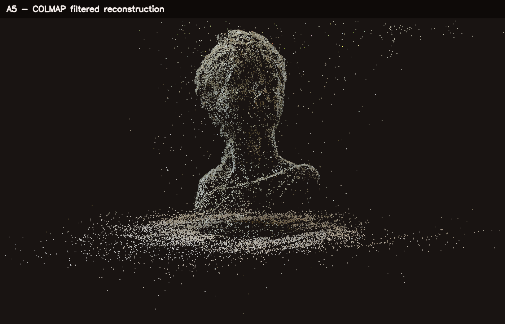
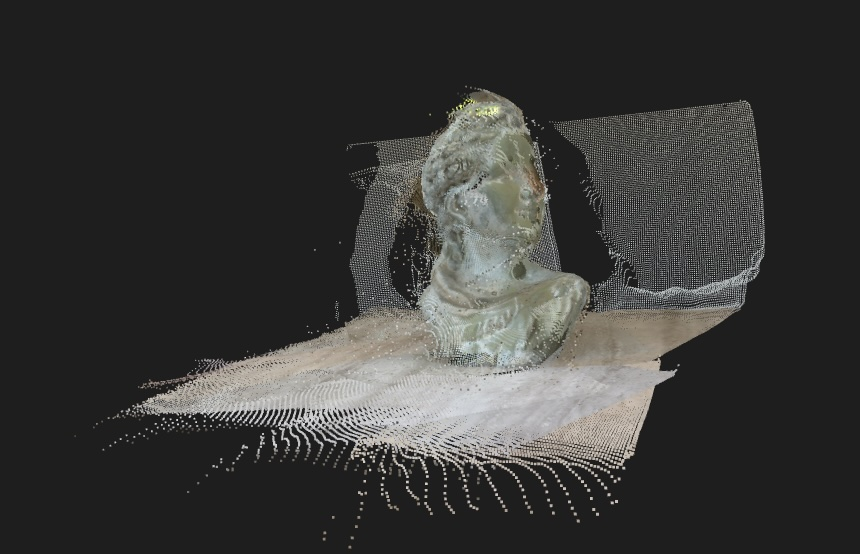
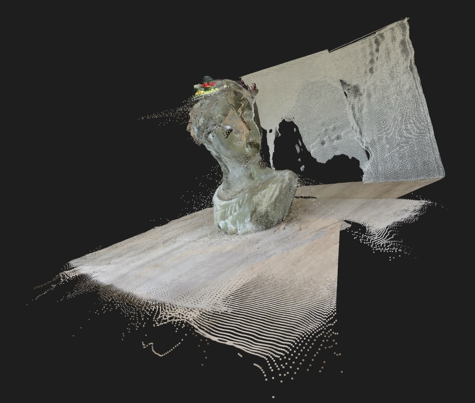
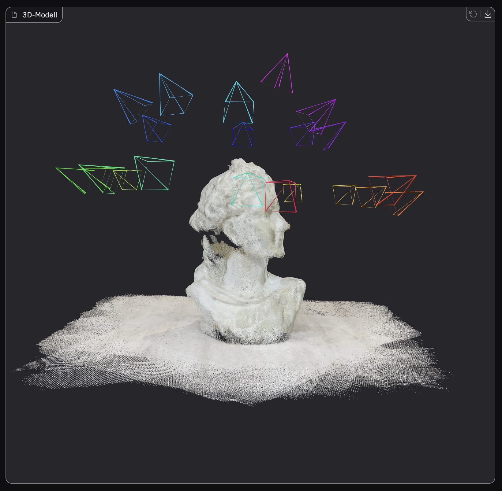
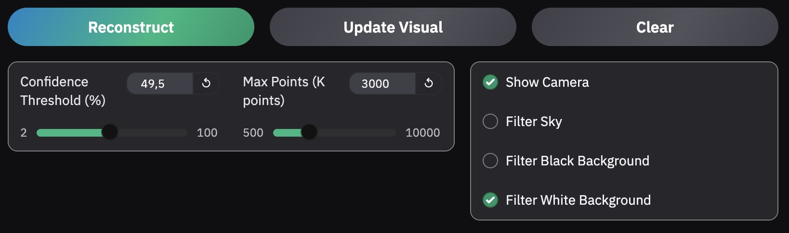
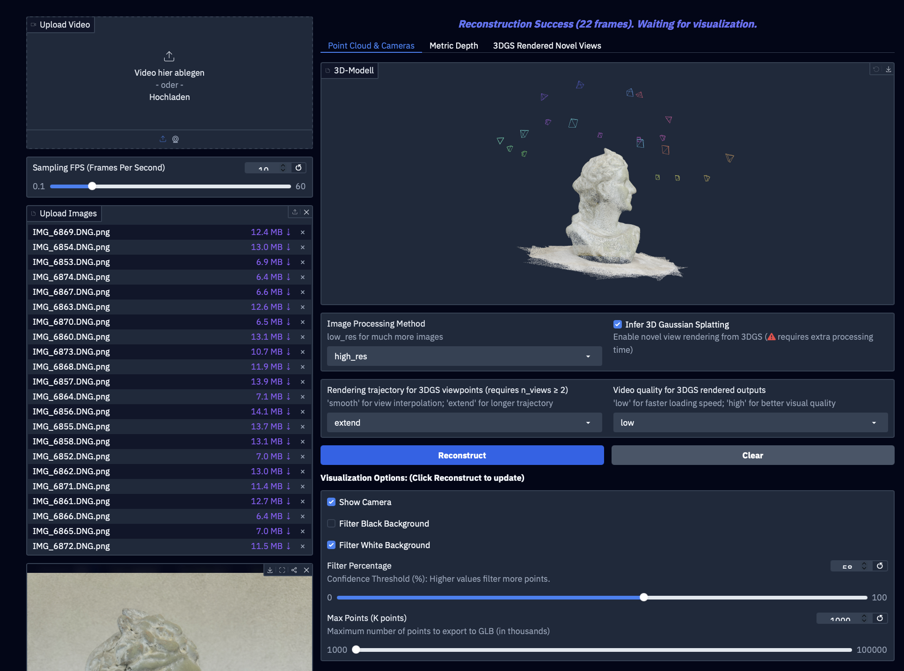

# A5 3D Reconstruction

This folder documents the A5 reconstruction workflow:

1. run a sparse COLMAP reconstruction from prepared image files,
2. run DUSt3R locally on macOS from the same image set,
3. keep the final screenshots and exported models in `a5/results/`.

The active local code focuses on COLMAP and DUSt3R. VGGT/Omega, DA3 and
3D Splats App outputs are documented as additional comparison results.

## Data

The active input images are here:

```text
a5/data/scene/images_colmap_ql/   22 PNG exports for COLMAP and DUSt3R
a5/data/scene/images/             original DNG captures
```

The scripts default to `a5/data/scene/images_colmap_ql/`.

## Capture Setup and Model Choice

The scene was captured with an iPhone camera as an overlapping image sequence.
The original DNG files are kept locally in `a5/data/scene/images/`; for the
reconstruction, 22 PNG images at 1800 x 2400 pixels were prepared
from them. These prepared images are used by both COLMAP and DUSt3R so that the
methods work on the same input data.

DUSt3R was selected as the geometric foundation model because it can be run on
macOS and can directly predict a 3D point cloud from multiple images without a
classic SfM preprocessing step. COLMAP is used as a geometric reference for
camera poses and sparse points. VGGT/Omega and DA3 were additionally run via
Hugging Face to compare the local results with other current reconstruction
approaches.

## Setup

Install COLMAP and create the course environment on macOS:

```bash
brew install colmap python@3.12
python3 -m venv .venv
.venv/bin/pip install -r a5/requirements.txt
```

For DUSt3R, use a separate Python 3.12 environment and clone the official
repository outside this repo:

```bash
git clone https://github.com/naver/dust3r ../dust3r
cd ../dust3r
git submodule update --init --recursive
cd ../Computer-Vision

python3.12 -m venv a5/.venv-dust3r
a5/.venv-dust3r/bin/python -m pip install -r ../dust3r/requirements.txt
```

If PyTorch with MPS is not installed by the DUSt3R requirements on your Mac,
install the current macOS wheel recommended by PyTorch before running DUSt3R.

## COLMAP

Run the image-only COLMAP pipeline:

```bash
./a5/start_native_macos.sh
```

Useful options:

```bash
./a5/start_native_macos.sh \
  --images a5/data/scene/images_colmap_ql \
  --threads 8 \
  --max-features 20000 \
  --feature-max-image-size 0 \
  --matcher exhaustive \
  --guided-matching \
  --keep-two-view-tracks
```

These are also the defaults. They favor a denser sparse point cloud over speed:
COLMAP extracts more SIFT features, uses the full image resolution, matches all
image pairs, keeps two-view tracks, and uses slightly more permissive mapper
filters.

If this is too slow, use sequential matching:

```bash
./a5/start_native_macos.sh --matcher sequential --sequential-overlap 10
```

Outputs:

```text
a5/colmap/sparse/              COLMAP binary sparse model
a5/colmap/sparse_text/         COLMAP text model, including images.txt
a5/colmap/sparse_points.ply    sparse colored point cloud
a5/img/colmap_sparse.png       rendered sparse points and camera positions
a5/results/colmap/             copied COLMAP submission results
```

Filter isolated outlier points after COLMAP:

```bash
.venv/bin/python a5/src/filter_point_cloud.py \
  a5/colmap/sparse_points.ply \
  --output a5/colmap/sparse_points_filtered.ply \
  --neighbors 8 \
  --std-ratio 1.5 \
  --keep-percentile 97 \
  --radius-percentile 99

.venv/bin/python a5/src/visualize.py \
  a5/colmap/sparse_points_filtered.ply \
  --cameras a5/colmap/sparse_text/images.txt \
  --screenshot a5/img/colmap_sparse_filtered.png
```

## DUSt3R Local

Run DUSt3R on the same prepared images:

```bash
./a5/start_dust3r_macos.sh \
  --dust3r-repo ../dust3r \
  --device cpu \
  --image-size 224 \
  --max-images 6 \
  --niter 100 \
  --output-dir a5/results/dust3r_local
```

The installed PyTorch build on this machine reports no MPS support, so the
recorded result uses CPU, 6 images, 224 px image size and 100 optimization
iterations.

The higher quality local run uses two more images and a larger DUSt3R input
size:

```bash
./a5/start_dust3r_macos.sh \
  --dust3r-repo ../dust3r \
  --device cpu \
  --image-size 512 \
  --max-images 8 \
  --niter 150 \
  --output-dir a5/results/dust3r_local_512_8img
```

Outputs:

```text
a5/results/dust3r_local/dust3r_points.ply
a5/results/dust3r_local/dust3r_points.png
a5/results/dust3r_local/metadata.json
a5/results/dust3r_local_512_8img/dust3r_points.ply
a5/results/dust3r_local_512_8img/dust3r_points.png
a5/results/dust3r_local_512_8img/metadata.json
```

## Results

The generated results are collected in `a5/results/`. The active workflow uses
only the prepared images from `a5/data/scene/images_colmap_ql/` and produces
one COLMAP result as well as two local DUSt3R results.

The local experiments were run on a Mac. Since the used PyTorch environment did
not report usable MPS acceleration, the DUSt3R runs were executed on CPU with
adapted image counts and resolutions. For comparison with further
reconstruction approaches, VGGT/Omega and DA3 were additionally generated via
Hugging Face or external tools and stored in `results/`.

| Result | Method | Content | Files |
| --- | --- | --- | --- |
| `results/colmap/` | COLMAP sparse reconstruction | solid camera poses and sparse geometry, but a thin point cloud and gaps in the bust's face | `sparse_points.ply`, `sparse_points_filtered.ply`, `sparse_text/`, `database.db`, `colmap_sparse_filtered.png` |
| `results/dust3r_local/` | DUSt3R local, first run | local CPU run with 6 images and `image_size=224`; compact, but visibly limited by resolution and image count | `dust3r_points.ply`, `dust3r_points.png`, `metadata.json` |
| `results/dust3r_local_512_8img/` | DUSt3R local, higher-resolution run | local CPU run with 8 images and `image_size=512`; denser than the first run, but still smaller than the Hugging Face comparisons due to hardware constraints | `dust3r_points.ply`, `dust3r_points.png`, `metadata.json` |
| `results/VGGT_Omega_huggingface/` | VGGT/Omega via Hugging Face | good model comparison with an exported scene, overall strong, but with visible gaps around the bust's neck | `result.jpg`, `settings.jpg`, `scene_conf50.0_blackFalse_whiteTrue_camTrue_skyFalse_max1000k.glb` |
| `results/da3_huggingface/` | DA3 via Hugging Face | strongest qualitative result in the comparison, with an exported GLB scene and interpolated video | `DA3_Settings.jpg`, `scene.glb`, `0000_interpolate_smooth.mp4` |
| `results/3D Splats App/` | 3D Splats App | additional render video from the 3D Splats App as an alternative to Lichtfeld Studio | `render-2026-06-26-135528.mp4`, `splat-trained.ply`, `splat-trained.spz` |

### COLMAP

COLMAP was reconstructed from the 22 images. Afterwards, the point
cloud was cleaned with `filter_point_cloud.py` so that distant outliers affect
the final view less strongly.



### DUSt3R Local

The first local DUSt3R run was a fast test with fewer images and a lower
resolution. It already shows the scene, but it has significantly fewer points
than the later run.



The second local DUSt3R run uses two additional images and a larger DUSt3R input
resolution. This produces a significantly denser point cloud.



### VGGT/Omega via Hugging Face

VGGT/Omega was run via Hugging Face as an additional model comparison. The
result is stored as a GLB scene and contains the reconstructed bust as well as
the estimated camera positions. This makes the run useful for comparison with
COLMAP and DUSt3R: COLMAP shows the classic sparse SfM reconstruction, DUSt3R
provides a local point cloud, and VGGT/Omega adds a 3D scene generated via
Hugging Face.

The saved configuration shows a confidence threshold of about `49.5%`, an
export limit of `3000 K` points, visible cameras, and an enabled white
background filter. The GLB export is compact enough at roughly 15 MB to be
viewed directly as a 3D model.

```text
a5/results/VGGT_Omega_huggingface/result.jpg
a5/results/VGGT_Omega_huggingface/settings.jpg
a5/results/VGGT_Omega_huggingface/scene_conf50.0_blackFalse_whiteTrue_camTrue_skyFalse_max1000k.glb
```





### DA3 via Hugging Face

DA3 was also run via Hugging Face to compare another current reconstruction
approach on the same image data. The screenshot shows a successful
reconstruction with `22` frames. The `Point Cloud & Cameras` view is active in
the interface, so both the point cloud and the estimated camera views are
visible.

For this run, `high_res` was used as the image processing method. In addition,
`Infer 3D Gaussian Splatting` was enabled to produce novel-view-oriented results
besides the point cloud and cameras. The visualization options show cameras and
filter the white background. The GLB export is also roughly 15 MB. In addition,
an interpolated smooth video was exported from the DA3 result, showing the
scene from a moving view.

```text
a5/results/da3_huggingface/DA3_Settings.jpg
a5/results/da3_huggingface/scene.glb
a5/results/da3_huggingface/0000_interpolate_smooth.mp4
```



<video controls src="results/da3_huggingface/0000_interpolate_smooth.mp4" width="720"></video>

[DA3 interpolated video](results/da3_huggingface/0000_interpolate_smooth.mp4)

### 3D Splats App

As an additional side note, there is also a render video from the 3D Splats App.
It was generated from the same prepared images as the other reconstruction
runs. The app was tried as an alternative to Lichtfeld Studio and produces a
short moving view of the scene in addition to the trained splat model.

```text
a5/results/3D Splats App/render-2026-06-26-135528.mp4
a5/results/3D Splats App/splat-trained.ply
a5/results/3D Splats App/splat-trained.spz
```

<video controls src="results/3D%20Splats%20App/render-2026-06-26-135528.mp4" width="720"></video>

[3D Splats App video](results/3D%20Splats%20App/render-2026-06-26-135528.mp4)

## Repository Notes

The pipeline covers the complete path from the prepared image sequence to
visualization: COLMAP estimates camera poses and a sparse reconstruction,
DUSt3R runs as a local foundation model on the same images, and `visualize.py`
renders the point clouds as PNG files. The visualizer GUI also allows the final
viewpoint for the screenshots to be adjusted interactively.

Several compact 3D files are stored directly in `results/`, for example
`results/colmap/sparse_points_filtered.ply`,
`results/dust3r_local/dust3r_points.ply`,
`results/VGGT_Omega_huggingface/*.glb`, and
`results/da3_huggingface/scene.glb`. Large input data and additional large
results remain available locally and are not added to the repository through
`.gitignore`.

## Discussion

### COLMAP

COLMAP provides a solid geometric baseline because it does not try to infer
surfaces, but only matches stable image features, estimates camera poses from
them, and then triangulates the points. The rough silhouette of the bust, the
head, the neck, and the ground plane are understandable in the result. However,
compared to the foundation-model results, the point count is rather thin, and
visible gaps appear especially in the face of the bust.

These gaps fit COLMAP's method: smooth, bright surfaces of the bust provide
fewer distinctive SIFT features than edges, hair structure, or high-contrast
regions. Where too few stable matches exist, no dense geometry is created.
Scattered points in the upper image area and on the ground can also result from
weak or ambiguous matches. The post-processing filter removes isolated outliers,
but it cannot semantically distinguish between the object and the surrounding
scene. Qualitatively, COLMAP is therefore useful as a reference for camera poses
and sparse geometry, but the result remains visibly incomplete and less dense
than the learning-based methods.

### DUSt3R

DUSt3R creates much denser point clouds than COLMAP because the model does not
only triangulate individual feature points. Instead, it predicts dense 3D point
maps for image pairs and then aligns them globally. This makes the local result
more visually readable: the face, hair, neck, and base are more connected than
in the COLMAP reconstruction. The first run with 6 images and `image_size=224`
is more compact, but shows less detail and rougher surfaces.

The local DUSt3R results are directly shaped by the available hardware. Since
the macOS environment did not provide usable MPS acceleration, the experiments
ran on CPU. Compared with the Hugging Face runs, fewer images and lower
processing resolutions were therefore used, and the runtime was noticeably more
relevant. This explains why local DUSt3R does not reach the same quality and
completeness as DA3 or VGGT/Omega via Hugging Face.

DUSt3R's strength is also one source of its artifacts: the model estimates dense
geometry even in regions where COLMAP would have very few features. As a result,
not only the bust is reconstructed, but also the tabletop, wall, and background.
The higher run with 8 images and `image_size=512` produces many more points,
but also more visible artifacts. More image pairs, higher resolution, and more
dense predictions can introduce more slightly inconsistent depth and point
estimates into the global alignment. These large background surfaces and local
errors partly dominate the visualization and make it harder to inspect the
object alone. Overall, DUSt3R is the best fully local result, but it remains
visibly limited compared to the Hugging Face results.

### VGGT/Omega

VGGT/Omega reconstructs the bust well overall and shows the estimated camera
positions very clearly. Unlike COLMAP, the model works feed-forward on multiple
views and estimates the scene, cameras, and geometry more directly from the
image content. As a result, the output is less fragmented than the purely sparse
reconstruction, and the bust is easy to recognize as an object. The camera
frames also make it understandable from which viewpoints the scene was
reconstructed.

Still, VGGT/Omega is not the strongest result. Visible gaps appear around the
neck of the bust, making the transition between head, neck, and base less
convincing. This fits a confidence-based export: in uncertain regions, at
transitions, near occlusions, or on less distinctive surfaces, points are more
likely to be weak or incomplete. The chosen configuration with about `49.5%`
confidence threshold, visible cameras, and white background filtering is a
reasonable compromise between completeness and a clean visualization.
Qualitatively, VGGT/Omega is a good and presentable result, but it ranks behind
DA3 because of the neck gaps.

### DA3

DA3 provides the strongest qualitative result in this comparison. The method is
more depth-based: depth information and cameras are estimated from the views and
then fused into a scene. This makes the result less dependent on individual
local feature matches than COLMAP, and it also appears more stable than
VGGT/Omega around the neck region. The Hugging Face run reconstructs the bust
as a coherent object, shows the camera positions clearly, and benefits from
`high_res` as well as enabled 3D Gaussian Splatting.

The additional interpolated video is especially useful because it does not only
provide a moving view, but also makes the depth map and the quality of the
object reconstruction easier to judge. It shows that the bust was reconstructed
more completely overall and has fewer critical gaps than VGGT/Omega around the
neck. The white background filter reduces distracting regions, but it does not
remove all non-object areas. Overall, DA3 is therefore the best result for the
final quality assessment, while COLMAP remains important as a geometric
reference and DUSt3R as the local run.

## Manual Commands

Run COLMAP directly:

```bash
.venv/bin/python a5/src/run_colmap.py \
  --images a5/data/scene/images_colmap_ql \
  --workspace a5/colmap \
  --overwrite \
  --max-features 20000 \
  --feature-max-image-size 0 \
  --matcher exhaustive
```

Render the COLMAP result:

```bash
.venv/bin/python a5/src/visualize.py \
  a5/colmap/sparse_points.ply \
  --cameras a5/colmap/sparse_text/images.txt \
  --screenshot a5/img/colmap_sparse.png
```

Run DUSt3R directly:

```bash
a5/.venv-dust3r/bin/python a5/src/run_dust3r_local.py \
  --dust3r-repo ../dust3r \
  --images a5/data/scene/images_colmap_ql \
  --device cpu \
  --image-size 512 \
  --max-images 8 \
  --niter 150 \
  --output-dir a5/results/dust3r_local_512_8img
```
